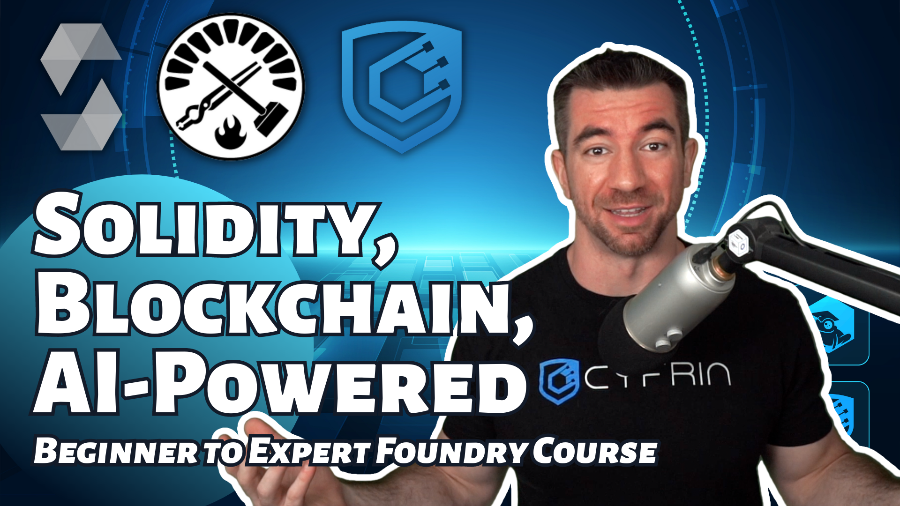
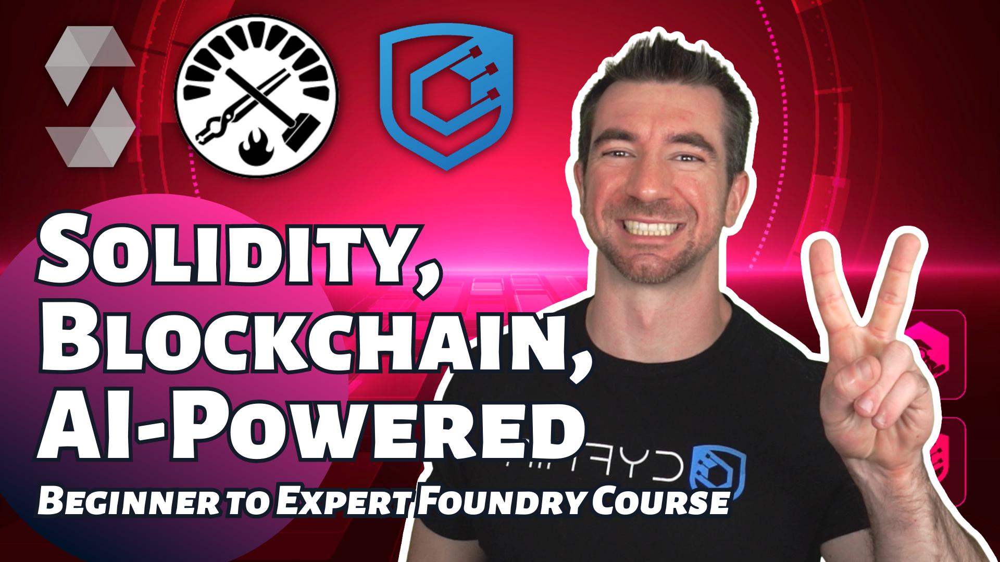
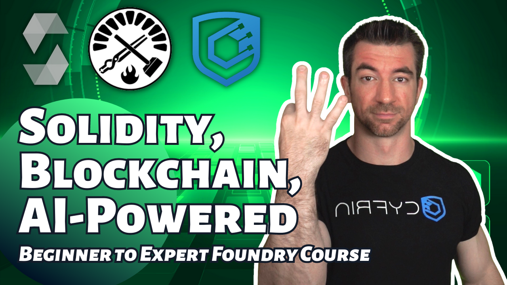

<h1>Web3 Development, Smart Contract & Solidity Course   Powered By AI  </h1>
<strong>Học cách phát triển Smart Contract Solidity và các ứng dụng Web3 tương thích EVM</strong>

     
    

     

Chào mừng bạn đến với repository của khoá học Web3 Development, Smart Contract & Solidity Course. Khoá học này được phát triển bởi <a href="https://cyfrin.io/">Cyfrin</a> và <a href="https://www.youtube.com/@PatrickAlphaC">Patrick Collins</a>, cập nhật, sửa đổi và dịch thuật sang tiếng Việt bởi <a href="https://www.youtube.com/channel/UC0QESw8LTPb841qcABmOsvA">Terran Crypt</a>.

# Foundry Full Course F23

Trong toàn bộ khoá học này, phần lớn kiến thức là đến từ khoá học Foundry Full Course F23 của Cyfrin's Updraft. Tuy nhiên sẽ có thay đổi để cập nhật kiến thức và dịch thuật, diễn đạt nội dung để phù hợp hơn với khán giả Việt Nam.

## Link gốc của khoá học
 
<table>
  <tr>
    <th align="center">Lessons 0 - 6</th>
    <th align="center">Lessons 7 - 11</th>
    <th align="center">Lessons 12 - 15</th>
  </tr>
  <tr>
    <td align="center">
      
    </td>
    <td align="center">
      
    </td>
    <td align="center">
      
    </td>
  </tr>
</table>
 

## Link content của Cyfrin

-   [Website](https://updraft.cyfrin.io) - Webside chính thức của Cyfrin's Updraft, nơi bạn có thể học rất nhiều khoá học từ cơ bản đến nâng cao về Smart Contract & Solidity.
-   [Twitter](https://x.com/CyfrinUpdraft) - Link X của Cyfrin để liên tục cập nhật thông tin.
-   [LinkedIn](https://www.linkedin.com/school/cyfrin-updraft/) - Linkedin của Cyfrin's Updraft
-   [Discord](https://discord.gg/cyfrin) - Trang Discord của Cyfrin
-   [Newsletter](https://cyfrin.io/newsletter) - Bản tin hàng tuần về bảo mật và mẹo hay cho việc phát triển hợp đồng thông minh
-   [Codehawks](https://codehawks.com) - Nền tảng cho các cuộc thi audit được phát triển bởi Cyfrin.

# Tài nguyên dành cho khoá học này
- Testnet: Sepolia.

> ⚠️ Tất cả code liên quan đến khóa học này chỉ nhằm mục đích demo. Tất cả chưa được audit và không được coi là đã sẵn sàng để đưa vào production.

## Testnet Faucets
- Faucet chính: https://sepoliafaucet.com
- Faucet backup: https://faucets.chain.link/sepolia

## AI
- ChatGPT: https://chat.openai.com
- Phind: https://www.phind.com
- Bard: https://bard.google.com

## Nơi đặt câu hỏi
- Ethereum Stack Exchange: https://ethereum.stackexchange.com
- Peeranha: https://peeranha.io